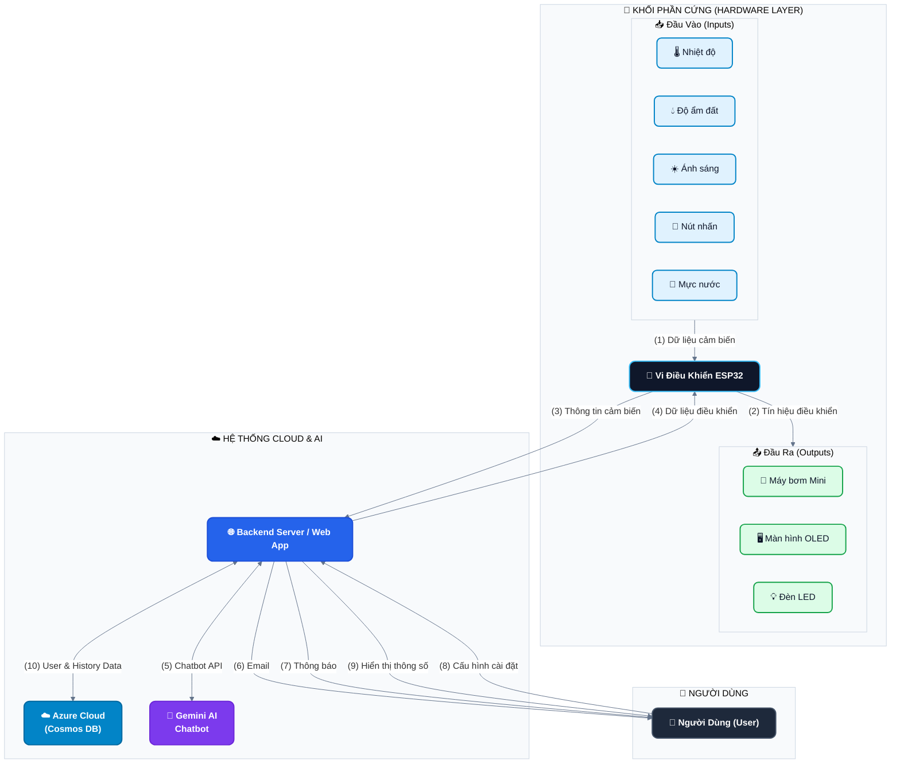

```mermaid
%%{
  init: {
    'theme': 'base',
    'themeVariables': {
      'fontFamily': 'system-ui, -apple-system, sans-serif',
      'primaryColor': '#ffffff',
      'primaryBorderColor': '#3b82f6',
      'lineColor': '#64748b',
      'tertiaryColor': '#f8fafc',
      'edgeLabelBackground': '#ffffff',
      'clusterBkg': '#f8fafc',
      'clusterBorder': '#cbd5e1'
    }
  }
}%%
flowchart TB
    %% ----------------------------------------------------
    %% SUBGRAPH 1: PHẦN CỨNG (FIELD LAYER)
    %% ----------------------------------------------------
    subgraph FIELD [" 🔌 KHỐI PHẦN CỨNG (HARDWARE LAYER) "]
        direction TB
        
        subgraph INPUTS [" 📥 Đầu Vào (Inputs) "]
            I1["🌡️ Nhiệt độ"]
            I2["💧 Độ ẩm đất"]
            I3["☀️ Ánh sáng"]
            I4["🔴 Nút nhấn"]
            I5["🌊 Mực nước"]
        end

        ESP["🔲 Vi Điều Khiển ESP32"]

        subgraph OUTPUTS [" 📤 Đầu Ra (Outputs) "]
            O1["🚰 Máy bơm Mini"]
            O2["🖥️ Màn hình OLED"]
            O3["💡 Đèn LED"]
        end
    end

    %% ----------------------------------------------------
    %% SUBGRAPH 2: SERVER & CLOUD (BACKEND LAYER)
    %% ----------------------------------------------------
    subgraph SYSTEM [" ☁️ HỆ THỐNG CLOUD & AI "]
        direction LR
        WEB["🌐 Backend Server / Web App"]
        AZURE["☁️ Azure Cloud\n(Cosmos DB)"]
        GEMINI["🤖 Gemini AI\nChatbot"]
    end

    %% ----------------------------------------------------
    %% SUBGRAPH 3: USER LAYER
    %% ----------------------------------------------------
    subgraph USER_ZONE [" 👤 NGƯỜI DÙNG "]
        USER["👤 Người Dùng (User)"]
    end

    %% ----------------------------------------------------
    %% DÒNG DỮ LIỆU & TƯƠNG TÁC (CONNECTIONS)
    %% ----------------------------------------------------
    INPUTS -->|" (1) Dữ liệu cảm biến " | ESP
    ESP -->|" (2) Tín hiệu điều khiển " | OUTPUTS
    
    ESP -->|" (3) Thông tin cảm biến " | WEB
    WEB -->|" (4) Dữ liệu điều khiển " | ESP
    
    WEB <-->|" (5) Chatbot API " | GEMINI
    WEB <-->|" (10) User & History Data " | AZURE
    
    WEB -->|" (6) Email " | USER
    WEB -->|" (7) Thông báo " | USER
    USER -->|" (8) Cấu hình cài đặt " | WEB
    WEB -->|" (9) Hiển thị thông số " | USER

    %% ----------------------------------------------------
    %% PHONG CÁCH ĐỒ HỌA (STYLING)
    %% ----------------------------------------------------
    classDef inputStyle fill:#e0f2fe,stroke:#0284c7,stroke-width:2px,color:#0f172a,rx:8px,ry:8px;
    classDef outputStyle fill:#dcfce7,stroke:#16a34a,stroke-width:2px,color:#0f172a,rx:8px,ry:8px;
    classDef espStyle fill:#0f172a,stroke:#38bdf8,stroke-width:2px,color:#ffffff,font-weight:bold,rx:10px,ry:10px;
    classDef webStyle fill:#2563eb,stroke:#1d4ed8,stroke-width:2px,color:#ffffff,font-weight:bold,rx:10px,ry:10px;
    classDef azureStyle fill:#0284c7,stroke:#0369a1,stroke-width:2px,color:#ffffff,font-weight:bold,rx:10px,ry:10px;
    classDef geminiStyle fill:#7c3aed,stroke:#6d28d9,stroke-width:2px,color:#ffffff,font-weight:bold,rx:10px,ry:10px;
    classDef userStyle fill:#1e293b,stroke:#475569,stroke-width:2px,color:#ffffff,font-weight:bold,rx:10px,ry:10px;

    class I1,I2,I3,I4,I5 inputStyle;
    class O1,O2,O3 outputStyle;
    class ESP espStyle;
    class WEB webStyle;
    class AZURE azureStyle;
    class GEMINI geminiStyle;
    class USER userStyle;
```
